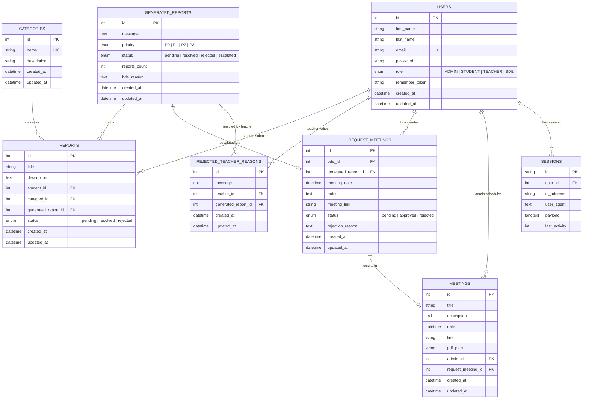

# YouPorts — Entity Relationship Diagram

```mermaid
erDiagram
    direction TB

    USERS {
        int     id              PK
        string  first_name
        string  last_name
        string  email           UK
        string  password
        enum    role            "ADMIN | STUDENT | TEACHER | BDE"
        string  remember_token
        datetime created_at
        datetime updated_at
    }

    CATEGORIES {
        int     id              PK
        string  name            UK
        string  description
        datetime created_at
        datetime updated_at
    }

    REPORTS {
        int     id              PK
        string  title
        text    description
        int     student_id      FK
        int     category_id     FK
        int     generated_report_id FK
        enum    status          "pending | resolved | rejected"
        datetime created_at
        datetime updated_at
    }

    GENERATED_REPORTS {
        int     id              PK
        text    message
        enum    priority        "P0 | P1 | P2 | P3"
        enum    status          "pending | resolved | rejected | escalated"
        int     reports_count
        text    bde_reason
        datetime created_at
        datetime updated_at
    }

    REJECTED_TEACHER_REASONS {
        int     id              PK
        text    message
        int     teacher_id      FK
        int     generated_report_id FK
        datetime created_at
        datetime updated_at
    }

    REQUEST_MEETINGS {
        int     id              PK
        int     bde_id          FK
        int     generated_report_id FK
        datetime meeting_date
        text    notes
        string  meeting_link
        enum    status          "pending | approved | rejected"
        text    rejection_reason
        datetime created_at
        datetime updated_at
    }

    MEETINGS {
        int     id              PK
        string  title
        text    description
        datetime date
        string  link
        string  pdf_path
        int     admin_id        FK
        int     request_meeting_id FK
        datetime created_at
        datetime updated_at
    }

    SESSIONS {
        string  id              PK
        int     user_id         FK
        string  ip_address
        text    user_agent
        longtext payload
        int     last_activity
    }

    USERS         ||--o{ REPORTS                  : "student submits"
    CATEGORIES    ||--o{ REPORTS                  : "classifies"
    GENERATED_REPORTS ||--o{ REPORTS              : "groups"
    GENERATED_REPORTS ||--o| REQUEST_MEETINGS     : "escalated via"
    GENERATED_REPORTS ||--o{ REJECTED_TEACHER_REASONS : "rejected by teacher"
    USERS         ||--o{ REJECTED_TEACHER_REASONS : "teacher writes"
    USERS         ||--o{ REQUEST_MEETINGS         : "bde creates"
    REQUEST_MEETINGS ||--o| MEETINGS              : "results in"
    USERS         ||--o{ MEETINGS                 : "admin schedules"
    USERS         ||--o{ SESSIONS                 : "has session"
```
