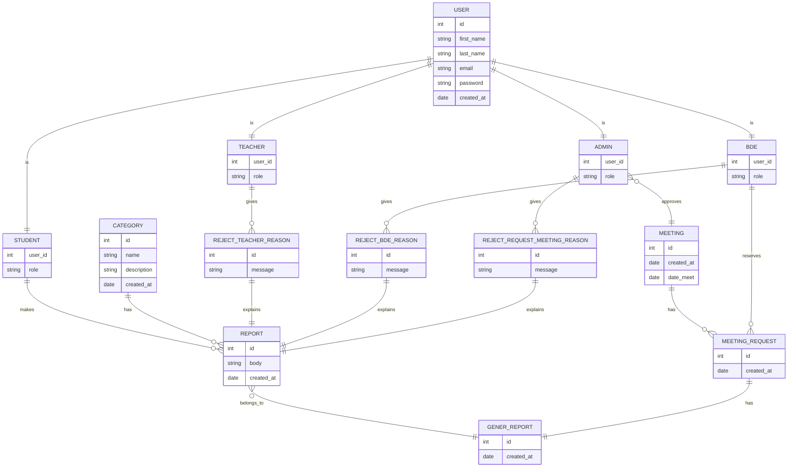

```mermaid

	erDiagram
		direction TB
		USER {
			int id  ""  
			string first_name  ""  
			string last_name  ""  
			string email  ""  
			string password  ""  
			date created_at  ""  
		}

		STUDENT {
			int user_id  ""  
			string role  ""  
		}

		ADMIN {
			int user_id  ""  
			string role  ""  
		}

		TEACHER {
			int user_id  ""  
			string role  ""  
		}

		BDE {
			int user_id  ""  
			string role  ""  
		}

		CATEGORY {
			int id  ""  
			string name  ""  
			string description  ""  
			date created_at  ""  
		}

		REPORT {
			int id  ""  
			string body  ""  
			date created_at  ""  
		}

		GENER_REPORT {
			int id  ""  
			date created_at  ""  
		}

		MEETING {
			int id  ""  
			date created_at  ""  
			date date_meet  ""  
		}

		MEETING_REQUEST {
			int id  ""  
			date created_at  ""  
		}

		REJECT_TEACHER_REASON {
			int id  ""  
			string message  ""  
		}

		REJECT_BDE_REASON {
			int id  ""  
			string message  ""  
		}

		REJECT_REQUEST_MEETING_REASON {
			int id  ""  
			string message  ""  
		}

		USER||--||STUDENT:"is"
		USER||--||ADMIN:"is"
		USER||--||TEACHER:"is"
		USER||--||BDE:"is"
		STUDENT||--o{REPORT:"makes"
		CATEGORY||--o{REPORT:"has"
		REPORT}o--||GENER_REPORT:"belongs_to"
		ADMIN}o--||MEETING:"approves"
		MEETING||--o{MEETING_REQUEST:"has"
		BDE||--o{MEETING_REQUEST:"reserves"
		MEETING_REQUEST||--||GENER_REPORT:"has"
		TEACHER||--o{REJECT_TEACHER_REASON:"gives"
		BDE||--o{REJECT_BDE_REASON:"gives"
		ADMIN||--o{REJECT_REQUEST_MEETING_REASON:"gives"
		REJECT_TEACHER_REASON||--||REPORT:"explains"
		REJECT_BDE_REASON||--||REPORT:"explains"
		REJECT_REQUEST_MEETING_REASON||--||REPORT:"explains"
```